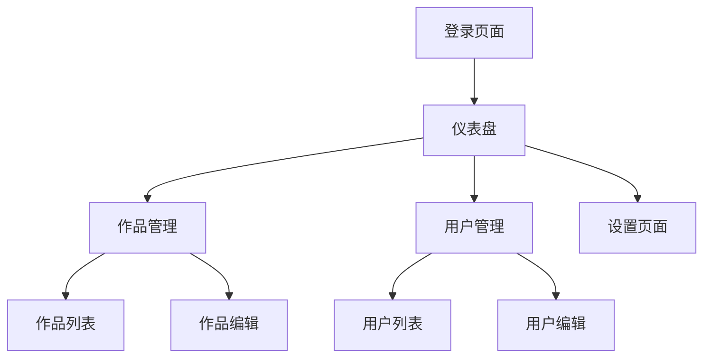

## 1. Product Overview
管理系统是一个基于现有Vue项目的后台管理平台，用于管理项目内容和数据。
- 主要功能包括用户管理、作品管理、数据统计和系统设置等核心功能
- 目标用户为项目管理员，提供高效便捷的管理工具

## 2. Core Features

### 2.1 User Roles
| 角色 | 注册方式 | 核心权限 |
|------|----------|----------|
| 管理员 | 邀请码注册 | 完整的系统管理权限 |
| 编辑 | 管理员邀请 | 内容编辑权限 |
| 查看者 | 公开访问 | 只读权限 |

### 2.2 Feature Module
1. **登录页面**：用户登录、权限验证、密码重置
2. **仪表盘**：数据概览、快速操作、最近活动
3. **作品管理**：作品列表、添加/编辑/删除作品、作品详情
4. **用户管理**：用户列表、添加/编辑/删除用户、权限管理
5. **设置页面**：系统配置、个人设置、通知设置

### 2.3 Page Details
| 页面名称 | 模块名称 | 功能描述 |
|---------|---------|----------|
| 登录页面 | 登录表单 | 用户名密码登录、第三方登录、忘记密码 |
| 仪表盘 | 数据概览 | 显示系统关键指标、图表统计、快速访问链接 |
| 作品管理 | 作品列表 | 分页展示作品、搜索筛选、批量操作 |
| 作品管理 | 作品编辑 | 上传图片、编辑信息、保存草稿、发布 |
| 用户管理 | 用户列表 | 展示用户信息、状态管理、权限分配 |
| 设置页面 | 系统配置 | 系统参数设置、主题设置、API配置 |

## 3. Core Process
用户登录系统后进入仪表盘，可通过左侧导航栏访问各个管理模块。在作品管理模块中，用户可以查看、添加、编辑和删除作品。在用户管理模块中，管理员可以管理用户账户和权限。设置页面用于配置系统参数和个人偏好。

## 4. User Interface Design
### 4.1 Design Style
- 主色调：深蓝色 (#1a365d) 和白色 (#ffffff)
- 辅助色：浅蓝色 (#3182ce)、绿色 (#38a169)、红色 (#e53e3e)
- 按钮样式：圆角按钮，悬浮效果
- 字体：Inter 字体，大小从 12px 到 24px
- 布局风格：侧边导航栏 + 顶部状态栏 + 主内容区
- 图标风格：线性图标，简洁现代

### 4.2 Page Design Overview
| 页面名称 | 模块名称 | UI元素 |
|---------|---------|--------|
| 登录页面 | 登录表单 | 居中布局，卡片式设计，渐变背景，响应式表单 |
| 仪表盘 | 数据概览 | 卡片式统计模块，折线图，饼图，网格布局 |
| 作品管理 | 作品列表 | 表格展示，搜索框，筛选器，批量操作按钮 |
| 作品管理 | 作品编辑 | 多步骤表单，图片上传组件，实时预览 |
| 用户管理 | 用户列表 | 表格展示，状态标签，权限下拉菜单 |
| 设置页面 | 系统配置 | 分组表单，开关组件，下拉选择器 |

### 4.3 Responsiveness
- 桌面优先设计，支持响应式布局
- 在平板和手机端自动调整为侧边栏折叠模式
- 触摸设备优化，增大点击区域

### 4.4 3D Scene Guidance
- 无3D场景需求