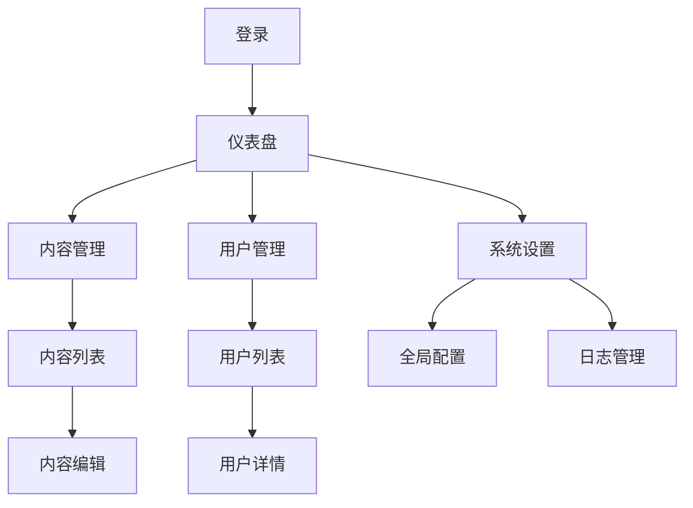

## 1. Product Overview
管理系统是一个功能强大的后台管理平台，用于监控网站访问数据和管理内容。
- 主要目的是帮助管理员实时了解网站流量和用户注册情况，同时提供内容管理能力。
- 目标用户为网站管理员，市场价值在于提升管理效率和数据驱动决策。

## 2. Core Features

### 2.1 User Roles
| Role | Registration Method | Core Permissions |
|------|---------------------|------------------|
| Admin | 管理员账号 | 访问所有功能，包括数据统计、内容管理、用户管理 |

### 2.2 Feature Module
1. **仪表盘**: 访问统计、注册数据、关键指标
2. **内容管理**: 上传、下架、排版、分类
3. **用户管理**: 用户列表、权限设置
4. **系统设置**: 全局配置、通知管理

### 2.3 Page Details
| Page Name | Module Name | Feature description |
|-----------|-------------|---------------------|
| 仪表盘 | 访问统计 | 展示每日访问量、访问趋势、来源分析 |
| 仪表盘 | 注册数据 | 展示每日注册量、注册趋势、用户画像 |
| 内容管理 | 内容列表 | 展示所有内容，支持搜索、筛选、排序 |
| 内容管理 | 内容编辑 | 支持上传、编辑、排版、分类、上架/下架 |
| 用户管理 | 用户列表 | 展示所有用户，支持搜索、筛选、排序 |
| 用户管理 | 用户详情 | 查看用户信息、修改用户权限 |
| 系统设置 | 全局配置 | 配置系统参数、通知设置、安全设置 |
| 系统设置 | 日志管理 | 查看系统操作日志、错误日志 |

## 3. Core Process
管理员登录系统后，可以查看仪表盘了解网站数据，进入内容管理模块进行内容操作，或进入用户管理模块管理用户权限。

## 4. User Interface Design
### 4.1 Design Style
- 主色调: #3B82F6 (蓝色)、#10B981 (绿色)
- 辅助色: #6366F1 (紫色)、#F59E0B (橙色)
- 按钮风格: 圆角按钮，有悬停效果
- 字体: Inter，标题18-24px，正文14-16px
- 布局风格: 侧边导航栏 + 顶部状态栏 + 内容区域
- 图标风格: 线性图标，简洁现代

### 4.2 Page Design Overview
| Page Name | Module Name | UI Elements |
|-----------|-------------|-------------|
| 仪表盘 | 访问统计 | 卡片式布局，包含折线图、柱状图，颜色鲜明，数据直观 |
| 仪表盘 | 注册数据 | 卡片式布局，包含折线图、饼图，数据可视化效果好 |
| 内容管理 | 内容列表 | 表格布局，支持分页、排序，操作按钮清晰 |
| 内容管理 | 内容编辑 | 富文本编辑器，分类选择器，状态切换开关 |
| 用户管理 | 用户列表 | 表格布局，支持搜索、筛选，权限标识清晰 |
| 系统设置 | 全局配置 | 表单布局，分组清晰，选项明确 |

### 4.3 Responsiveness
- 设计采用桌面优先原则
- 支持平板设备自适应布局
- 移动端优化，确保核心功能可用

### 4.4 3D Scene Guidance
- 无3D场景需求