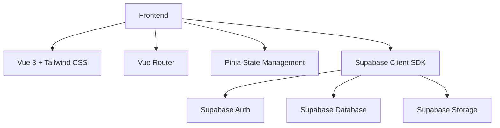
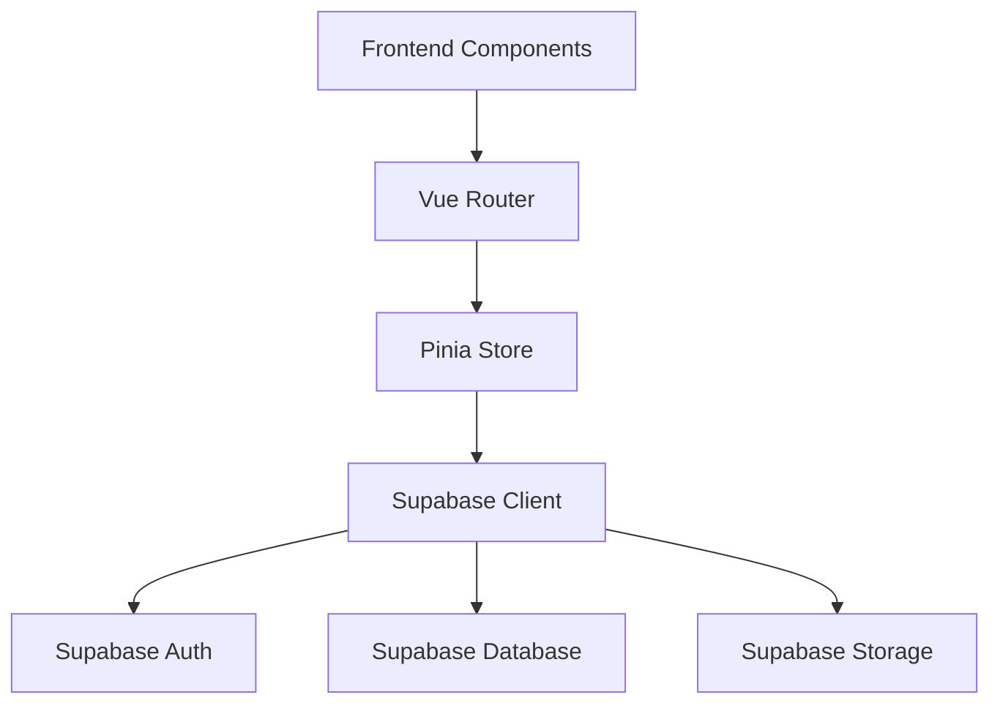
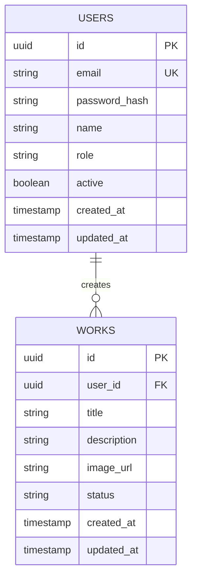

## 1. Architecture Design


## 2. Technology Description
- Frontend: Vue 3 + tailwindcss@3 + vite
- Initialization Tool: vite
- Backend: Supabase
- Database: Supabase (PostgreSQL)
- State Management: Pinia
- Routing: Vue Router
- UI Components: Custom components + Tailwind CSS

## 3. Route Definitions
| 路由 | 目的 |
|------|------|
| /login | 用户登录页面 |
| /dashboard | 仪表盘页面 |
| /works | 作品管理列表页面 |
| /works/create | 创建作品页面 |
| /works/:id/edit | 编辑作品页面 |
| /users | 用户管理列表页面 |
| /users/create | 创建用户页面 |
| /users/:id/edit | 编辑用户页面 |
| /settings | 系统设置页面 |

## 4. API Definitions
### 4.1 Supabase Auth API
- 登录: `supabase.auth.signInWithPassword()`
- 注册: `supabase.auth.signUp()`
- 登出: `supabase.auth.signOut()`
- 获取用户信息: `supabase.auth.getUser()`

### 4.2 Supabase Database API
- 作品管理: `supabase.from('works').*()`
- 用户管理: `supabase.from('users').*()`

## 5. Server Architecture Diagram


## 6. Data Model
### 6.1 Data Model Definition


### 6.2 Data Definition Language
```sql
-- Create users table
CREATE TABLE IF NOT EXISTS users (
  id UUID PRIMARY KEY DEFAULT gen_random_uuid(),
  email TEXT UNIQUE NOT NULL,
  password_hash TEXT NOT NULL,
  name TEXT NOT NULL,
  role TEXT NOT NULL DEFAULT 'viewer',
  active BOOLEAN DEFAULT true,
  created_at TIMESTAMP WITH TIME ZONE DEFAULT NOW(),
  updated_at TIMESTAMP WITH TIME ZONE DEFAULT NOW()
);

-- Create works table
CREATE TABLE IF NOT EXISTS works (
  id UUID PRIMARY KEY DEFAULT gen_random_uuid(),
  user_id UUID REFERENCES users(id),
  title TEXT NOT NULL,
  description TEXT,
  image_url TEXT,
  status TEXT DEFAULT 'draft',
  created_at TIMESTAMP WITH TIME ZONE DEFAULT NOW(),
  updated_at TIMESTAMP WITH TIME ZONE DEFAULT NOW()
);

-- Enable RLS
ALTER TABLE users ENABLE ROW LEVEL SECURITY;
ALTER TABLE works ENABLE ROW LEVEL SECURITY;

-- Create policies
CREATE POLICY "Users can view own data" ON users
  FOR SELECT USING (auth.uid() = id);

CREATE POLICY "Admins can view all users" ON users
  FOR SELECT USING (auth.jwt() ->> 'role' = 'admin');

CREATE POLICY "Users can create works" ON works
  FOR INSERT WITH CHECK (auth.uid() = user_id);

CREATE POLICY "Users can view own works" ON works
  FOR SELECT USING (auth.uid() = user_id);

CREATE POLICY "Admins can view all works" ON works
  FOR SELECT USING (auth.jwt() ->> 'role' = 'admin');

-- Grant permissions
GRANT SELECT ON users TO anon;
GRANT ALL PRIVILEGES ON users TO authenticated;
GRANT SELECT ON works TO anon;
GRANT ALL PRIVILEGES ON works TO authenticated;
```