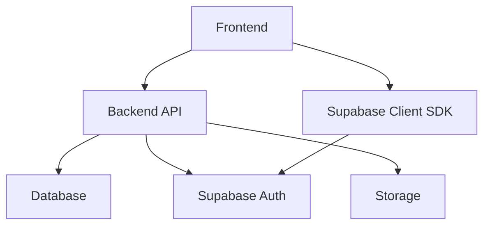
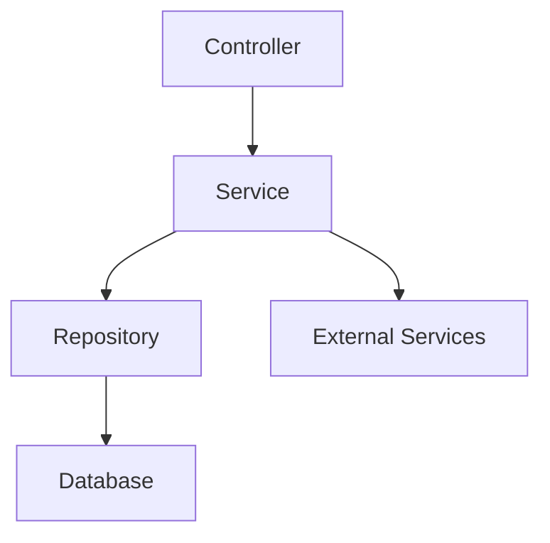
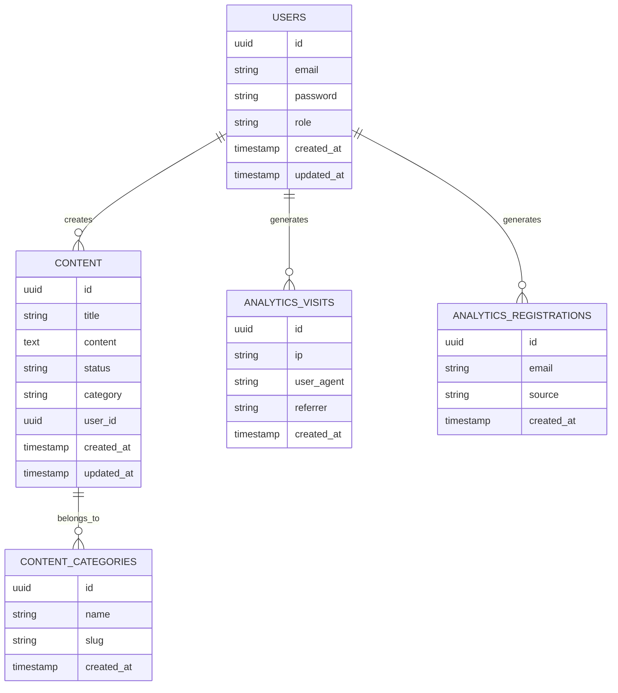

## 1. Architecture Design


## 2. Technology Description
- Frontend: React@18 + TypeScript + Tailwind CSS + Vite
- Initialization Tool: vite-init
- Backend: Express.js + TypeScript
- Database: Supabase (PostgreSQL)
- Authentication: Supabase Auth
- Storage: Supabase Storage
- UI Components: shadcn/ui
- Charts: Recharts

## 3. Route Definitions
| Route | Purpose |
|-------|---------|
| / | 仪表盘 |
| /dashboard | 仪表盘 |
| /content | 内容管理 |
| /content/create | 创建内容 |
| /content/edit/:id | 编辑内容 |
| /users | 用户管理 |
| /users/:id | 用户详情 |
| /settings | 系统设置 |
| /login | 登录 |

## 4. API Definitions
### 4.1 Auth API
- POST /api/auth/login: 登录
- POST /api/auth/logout: 登出
- GET /api/auth/me: 获取当前用户信息

### 4.2 Content API
- GET /api/content: 获取内容列表
- POST /api/content: 创建内容
- GET /api/content/:id: 获取内容详情
- PUT /api/content/:id: 更新内容
- DELETE /api/content/:id: 删除内容
- PUT /api/content/:id/status: 更新内容状态

### 4.3 Analytics API
- GET /api/analytics/visits: 获取访问数据
- GET /api/analytics/registrations: 获取注册数据
- GET /api/analytics/sources: 获取来源分析

### 4.4 User API
- GET /api/users: 获取用户列表
- GET /api/users/:id: 获取用户详情
- PUT /api/users/:id: 更新用户信息
- DELETE /api/users/:id: 删除用户

## 5. Server Architecture Diagram


## 6. Data Model
### 6.1 Data Model Definition


### 6.2 Data Definition Language
```sql
-- Users table
CREATE TABLE users (
    id UUID PRIMARY KEY DEFAULT gen_random_uuid(),
    email VARCHAR(255) UNIQUE NOT NULL,
    password VARCHAR(255) NOT NULL,
    role VARCHAR(50) DEFAULT 'user',
    created_at TIMESTAMP DEFAULT NOW(),
    updated_at TIMESTAMP DEFAULT NOW()
);

-- Content table
CREATE TABLE content (
    id UUID PRIMARY KEY DEFAULT gen_random_uuid(),
    title VARCHAR(255) NOT NULL,
    content TEXT,
    status VARCHAR(50) DEFAULT 'draft',
    category VARCHAR(100),
    user_id UUID REFERENCES users(id),
    created_at TIMESTAMP DEFAULT NOW(),
    updated_at TIMESTAMP DEFAULT NOW()
);

-- Content categories table
CREATE TABLE content_categories (
    id UUID PRIMARY KEY DEFAULT gen_random_uuid(),
    name VARCHAR(100) NOT NULL,
    slug VARCHAR(100) UNIQUE NOT NULL,
    created_at TIMESTAMP DEFAULT NOW()
);

-- Analytics visits table
CREATE TABLE analytics_visits (
    id UUID PRIMARY KEY DEFAULT gen_random_uuid(),
    ip VARCHAR(50),
    user_agent TEXT,
    referrer TEXT,
    created_at TIMESTAMP DEFAULT NOW()
);

-- Analytics registrations table
CREATE TABLE analytics_registrations (
    id UUID PRIMARY KEY DEFAULT gen_random_uuid(),
    email VARCHAR(255) NOT NULL,
    source VARCHAR(100),
    created_at TIMESTAMP DEFAULT NOW()
);

-- Create indexes
CREATE INDEX idx_content_status ON content(status);
CREATE INDEX idx_content_category ON content(category);
CREATE INDEX idx_analytics_visits_created_at ON analytics_visits(created_at);
CREATE INDEX idx_analytics_registrations_created_at ON analytics_registrations(created_at);

-- Insert initial data
INSERT INTO content_categories (name, slug) VALUES
('新闻', 'news'),
('教程', 'tutorials'),
('博客', 'blog'),
('产品', 'products');

-- Create admin user
INSERT INTO users (email, password, role) VALUES
('admin@example.com', '$2b$10$EixZaYVK1fsbw1ZfbX3OXePaWxn96p36WQoeG6Lruj3vjPGga31lW', 'admin');
```